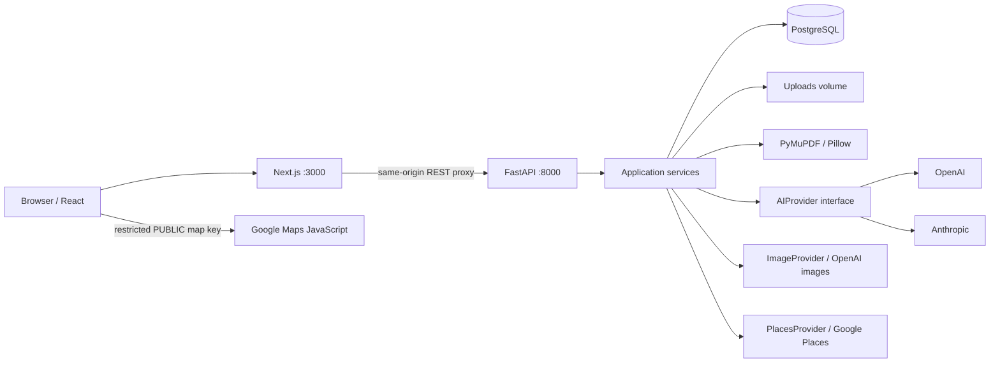

# MenuLens

Understand a menu. Find your next meal.

MenuLens is an AI-assisted menu reader and local restaurant discovery prototype. Unfamiliar dish names, photographed menus and inconsistent layouts make ordering harder than it should be. MenuLens turns menus into readable dish cards, explains unfamiliar foods, and helps diners discover nearby restaurants, cafes and bars.

**All nine planned implementation phases are complete.** Live provider verification still requires credentials. DeepSeek is a separate planned addition, not an available provider.

## Try it locally

Install Docker Desktop (or Docker Engine with Compose v2), then run from this directory:

```sh
cp .env.example .env  # Only on first setup; don't overwrite an existing .env.
docker compose up --build
```

The default local setup works without external API keys. It automatically seeds a fictional Hungarian menu once. PostgreSQL and uploaded/generated files use named Docker volumes; restarting containers preserves them.

- [Homepage](http://localhost:3000)
- [Hungarian sample menu](http://localhost:3000/demo) — four dishes, readable without keys.
- [Upload a menu](http://localhost:3000/upload)
- [Dish search](http://localhost:3000/search) — choose filters or browse saved dishes without keys.
- [Explore nearby](http://localhost:3000/explore) — Google configuration required for live results/maps.
- [API docs](http://localhost:8000/docs)
- [Health](http://localhost:8000/health) — checks the PostgreSQL connection.

For a no-key search, use **Choose filters**, ingredient **chicken**, maximum price **6000 HUF**; the sample's Csirkepaprikas matches. **Dessert** under **3000 HUF** matches Somloi galuska. AI actions are explicit and return a setup message when unconfigured.

## Features

- PDF, JPG and PNG uploads with size/type validation and safe UUID storage names.
- Digital PDF text extraction; scanned/mixed PDFs and images prepared for multimodal models.
- Replaceable OpenAI and Anthropic adapters; validated extraction with one invalid-output retry.
- Menu sections, HUF/other currency prices, source ingredients, and separate AI explanations/tags.
- Optional English/Hungarian explanations; no inferred allergy-safety claims.
- Natural-language intent interpretation followed by deterministic database filtering.
- Lazy, cached food illustrations labeled **AI-generated illustration**.
- Nearby restaurant/cafe/bar discovery with Google Places, Google Maps, distance filters and list view.
- Friendly loading, empty, missing-page, error and retry states; responsive layouts.
- Repeatable demo seeding with a downloadable source PDF, test coverage and deployment guidance.

## Screenshots


[Mobile menu](docs/screenshots/demo-mobile.png) · [Explore page](docs/screenshots/explore.png)

## Architecture



Routes validate HTTP inputs and delegate to services. Private AI/Places credentials stay on the backend. The separate Maps JavaScript key is intentionally browser-visible and must be restricted to your website and that API. Frontend code consumes normalized place DTOs, not Google's raw responses.

Menu extraction and explanation adapters return untrusted model output. Pydantic validates it before storage; one validation retry is allowed. Raw documents are treated as data in prompts. Search AI never receives database rows or chooses results: numeric/currency/menu-ID filters are deterministic, followed by explicit ingredient/name/tag matching. Text/schema validation does not prove factual accuracy.

Images are requested per dish and cached in PostgreSQL plus the uploads volume. No eager image generation occurs. Places results are transient and are not persisted. API calls to language providers live under `backend/app/services/ai`; image and Places adapters have separate interfaces.

## Stack and files

Next.js, React, TypeScript, Tailwind CSS; Python, FastAPI, Pydantic, SQLAlchemy; PostgreSQL; PyMuPDF, Pillow, HTTPX; Docker Compose; pytest.

```text
frontend/src/app/          Consumer pages, loading/error boundaries
frontend/src/components/  Upload, menu, dish, search and map components
frontend/src/services/    Typed REST client and map loader
backend/app/api/          Thin HTTP routes
backend/app/schemas/      Request, response and AI-output validation
backend/app/models/       SQLAlchemy persistence models
backend/app/services/     Business logic and provider abstractions
backend/app/data/         Versioned Hungarian demo JSON and PDF
backend/tests/            Mocked external-service and API tests
scripts/smoke.py          No-paid-API running-stack checks
.env.example              Configuration template; no real secrets
docker-compose.yml        Three services and persistent volumes
docs/                     Deployment, evaluation and verification notes
```

## Configuration

Edit the root `.env`; never commit it. Compose reads this file and passes selected settings to the backend. Run `docker compose up -d` after changing settings. Model names are explicit; there is no hidden paid default.

| Variable | Purpose |
|---|---|
| `DATABASE_URL` | SQLAlchemy PostgreSQL URL; Compose hostname is `postgres` |
| `POSTGRES_USER`, `POSTGRES_PASSWORD`, `POSTGRES_DB` | Initial PostgreSQL setup; local defaults only |
| `CORS_ORIGINS` | JSON array of allowed frontend origins |
| `SEED_DEMO` | `true` by default in Compose; adds the sample once, never overwrites it |
| `OPENAI_API_KEY`, `ANTHROPIC_API_KEY` | Private backend credentials |
| `MENU_AI_PROVIDER` | `openai` or `anthropic` |
| `MENU_AI_MODEL` | Provider model with the required structured-output and input capabilities |
| `MENU_AI_TIMEOUT_SECONDS`, `MENU_AI_MAX_OUTPUT_TOKENS` | Language-provider limits |
| `IMAGE_PROVIDER`, `IMAGE_MODEL` | `openai` and a compatible GPT Image model; uses `OPENAI_API_KEY` |
| `IMAGE_TIMEOUT_SECONDS`, `IMAGE_MAX_BYTES` | Image generation limits |
| `PLACES_API_KEY` | Private Google Places API (New) server key |
| `MAPS_API_KEY` | Separate public Google Maps JavaScript key restricted by website referrer |
| `MAPS_MAP_ID` | Map ID; `DEMO_MAP_ID` is the development default |
| `PLACES_TIMEOUT_SECONDS` | Places request deadline |
| `MAX_UPLOAD_BYTES` | File size limit; default 10 MiB |
| `UPLOAD_DIR` | Host-run backend storage; Compose sets `/app/uploads` |
| `DOCUMENT_MAX_*`, `DOCUMENT_IMAGE_EDGE` | Document page, pixel, text and output limits; see template |

To use Google, enable Places API (New) and Maps JavaScript API with billing. Restrict the server key to Places and appropriate server IPs; restrict the browser key to Maps JavaScript and permitted referrers such as `http://localhost:3000/*`. Do not reuse private keys as browser keys. Details and official references are in [the deployment guide](docs/deployment.md).

## Demo data

The fictional **Magyar Asztal** menu contains Gulyasleves (2990 HUF), Hortobagyi husos palacsinta (4590 HUF), Csirkepaprikas (5290 HUF), and Somloi galuska (2490 HUF). Source descriptions, ingredients and tags are hand-authored; no AI explanations or images are pre-generated. The PDF uses transliterated Hungarian names and English descriptions for readability.

Stable menu ID: `a1d8a5d1-8862-43b8-942b-6e96f746cd89`. The seed is transactional and idempotent; it does not overwrite changed/existing records. Set `SEED_DEMO=false` to disable startup seeding (this does not delete an existing demo). To seed manually:

```sh
docker compose exec backend python -m app.seed
```

The PDF is bundled at `backend/app/data/hungarian-menu.pdf`, downloadable at `/api/demo/source`, and copied to safe upload storage when seeded. It can also be uploaded normally to test document preparation; AI processing still needs credentials.

## API overview

| Method | Path | Purpose |
|---|---|---|
| GET | `/health` | Database-aware health |
| POST | `/api/menus` | Multipart menu upload |
| GET | `/api/menus/upload-config` | Upload limit |
| GET | `/api/menus/{id}` | Metadata, processing state, sections and items |
| GET | `/api/menus/{id}/items` | Ordered items |
| POST | `/api/menus/{id}/prepare` | Text/image preparation without AI |
| POST | `/api/menus/{id}/process` | Start validated AI extraction |
| GET, POST | `/api/menu-items/{id}/explanation` | Read/request EN or HU explanation |
| GET, POST | `/api/menu-items/{id}/image` | Read/request lazy image |
| GET | `/api/menu-items/{id}/image/content` | Cached image bytes |
| POST | `/api/search` | Natural-language query or explicit filters |
| GET | `/api/places/nearby` | Normalized nearby places |
| GET | `/api/places/{id}` | Normalized place details |
| GET | `/api/places/config` | Public map configuration only |
| GET | `/api/demo`, `/api/demo/source` | Demo availability and source PDF |

Full request/response schemas are in `/docs`. Nearby radius is 100–50,000 meters; UI offers 500 m–10 km. Results are limited to 20 nearest matches. Coordinates are validated and stripped from backend access-log query strings.

## Development and tests

```sh
cd backend
python3 -m venv .venv
. .venv/bin/activate
pip install -r requirements-dev.txt
pytest -q
```

Tests use isolated SQLite databases and mocked external providers. PostgreSQL is additionally checked through the running-stack smoke test. From the project root, after Compose is healthy:

```sh
python3 scripts/smoke.py
cd frontend
npm ci
npm run typecheck
npm run build
```

For host development, run PostgreSQL separately, set `DATABASE_URL` to its host-accessible address, and run `uvicorn app.main:app --reload --port 8000` from `backend`. Root `.env` is not automatically loaded from a different working directory; provide backend variables in your shell or a gitignored `backend/.env`. Run `BACKEND_URL=http://localhost:8000 npm run dev` from `frontend`. The default Compose PostgreSQL port is not published.

## Engineering decisions and limits

- Single backend worker: extraction, explanations and images use in-process background tasks. Startup marks interrupted jobs failed for explicit retry. No durable queue or automatic paid-provider retries.
- SQLAlchemy `create_all` creates missing tables, but does not migrate existing columns. Add migrations before changing a deployed schema.
- Search streams price/currency-filtered candidates then matches text/tags in Python. Suitable for the MVP; large catalogs need indexed search.
- Cache entries have no automatic invalidation by model/prompt version. A process crash can leave orphan files; backup/recovery guidance is documented.
- No authentication or public abuse controls. Uploaded menus are accessible to holders of their IDs. This is a local/private prototype, not a hardened public multi-user service.
- Restaurant-to-menu linking/persistence is not implemented; nearby discovery is independent of uploaded menus.
- AI interpretations, food illustrations and dietary tags are not guarantees. Check source menus and ask the restaurant about allergens.
- Live AI/Google quality, latency, cost and account compatibility are not verified by mock tests. Real browser geolocation and real Google map rendering also need manual credentialed testing.

See [deployment and recovery](docs/deployment.md), [model evaluation strategy](docs/evaluation.md), and [verification](docs/verification.md). Earlier phase notes are preserved in [implementation history](docs/implementation-history.md).

## Future work

DeepSeek support; credentialed provider evaluation; production authentication/rate controls and migrations when needed; durable jobs if traffic justifies them; better multilingual matching and optional restaurant/menu linking. Payments, reviews, reservations, delivery, nutrition estimates and social features remain out of scope.
