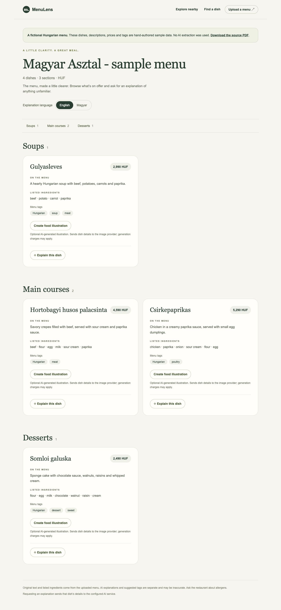
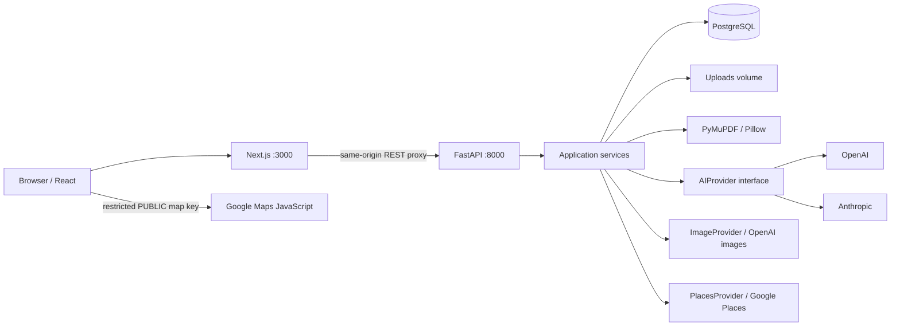

# MenuLens

Understand a menu. Find your next meal.

MenuLens is an AI-assisted menu reader and local restaurant discovery prototype. Unfamiliar dish names, photographed menus and inconsistent layouts make ordering harder than it should be. MenuLens turns menus into readable dish cards, explains unfamiliar foods, and helps diners discover nearby restaurants, cafes and bars.

The app runs locally with Docker. You can explore the included demo without any API keys, or configure OpenAI and Google to test the complete workflow. OpenAI and Anthropic are implemented; DeepSeek is not yet supported.

## Quick start

### 1. Get the project

Install **Git** and **Docker Desktop** (or Docker Engine with Compose v2). Start Docker before continuing. Docker installs the application dependencies inside containers; you do not need Python, Node.js or PostgreSQL installed on your computer to run the app this way.

Clone this repository using its **Code → SSH** address on GitHub, then open the cloned folder. Replace `OWNER` with the repository owner's GitHub username or organization:

```sh
git clone git@github.com:OWNER/menulens.git
cd menulens
```

You can also use **Code → Download ZIP**, extract it, and open a terminal in the extracted folder. All Docker commands below run in the directory containing `docker-compose.yml`, `frontend/`, and `backend/`.

### 2. Create your local configuration

Copy the included template **once**, only if you do not already have `.env`:

```sh
# macOS / Linux
test -f .env || cp .env.example .env
```

```powershell
# Windows PowerShell
if (!(Test-Path .env)) { Copy-Item .env.example .env }
```

Open `.env` in your editor. On macOS you can use `open -e .env`; on Windows, `notepad .env`. Make sure the filename is exactly `.env`, not `.env.txt`.

```text
menulens/
├── .env              ← put your actual API keys here (private, ignored by Git)
├── .env.example      ← shareable template with empty key fields
├── docker-compose.yml
├── frontend/
└── backend/
```

**For a no-key demo, leave the API fields empty and go to step 3.** Demo browsing, uploading files, document preparation and explicit search filters work without paid providers. Menu extraction, explanations, natural-language search, illustrations and live discovery require the relevant configuration below.

#### OpenAI: menu understanding and food illustrations

Create an API key in your [OpenAI API account](https://platform.openai.com/api-keys), and configure API billing/credits there. A ChatGPT subscription does not provide API credits for this application. Set these existing lines in `.env` (do not add duplicate entries):

```dotenv
OPENAI_API_KEY=REPLACE_WITH_YOUR_OPENAI_KEY
MENU_AI_PROVIDER=openai
MENU_AI_MODEL=gpt-4.1-mini
IMAGE_PROVIDER=openai
IMAGE_MODEL=gpt-image-1-mini
ANTHROPIC_API_KEY=
```

The model names above are economical testing examples. Your account must have access to the selected models; requests may incur charges. Image generation uses the same OpenAI key and only runs when you request an illustration. Model capabilities and account requirements can change: see [OpenAI model documentation](https://developers.openai.com/api/docs/models).

Anthropic is optional: use `MENU_AI_PROVIDER=anthropic`, set `ANTHROPIC_API_KEY`, and choose a compatible `MENU_AI_MODEL`. Food illustration generation still uses OpenAI independently.

#### Google: maps and nearby places

In [Google Cloud Console](https://console.cloud.google.com/), select your project, enable billing, and enable **Maps JavaScript API** and **Places API (New)**. MenuLens does not need the other Google Maps APIs.

In **APIs & Services → Credentials**, create/configure two keys in the same project:

| Key | Used for | API restriction | Application restriction |
|---|---|---|---|
| MenuLens Browser | Showing the map | Maps JavaScript API | Websites: `http://localhost:3000/*` |
| MenuLens Server | Finding nearby places | Places API (New) | Your server's public outbound IP when practical |

If you open the app at `http://127.0.0.1:3000`, also allow `http://127.0.0.1:3000/*` on the browser key. A website-restricted key does not work for the backend Places requests. For server IP restrictions, use the public outbound IP, not `localhost`, a Docker address or `127.0.0.1`; a changing home IP requires updating that restriction.

```dotenv
MAPS_API_KEY=REPLACE_WITH_YOUR_GOOGLE_BROWSER_KEY
PLACES_API_KEY=REPLACE_WITH_YOUR_GOOGLE_SERVER_KEY
MAPS_MAP_ID=DEMO_MAP_ID
```

A browser key is a normal API key configured for website use. It is intentionally visible to the browser, which is why restrictions matter. One key can technically serve both roles if its restrictions allow both, but separate keys are recommended so the browser cannot expose the private server credential.

`DEMO_MAP_ID` is Google's shared map configuration for development, not an API key. Leave it exactly as shown for local testing. It enables the advanced markers used here; it does not remove API-key or billing requirements. Use your own map ID before production. See [Google setup](https://developers.google.com/maps/documentation/javascript/get-api-key) and [map ID guidance](https://developers.google.com/maps/documentation/javascript/advanced-markers/start).

Keep the template's local database settings unless you deliberately change them. `DATABASE_URL` must match `POSTGRES_USER`, `POSTGRES_PASSWORD` and `POSTGRES_DB`; the hostname is `postgres` inside Docker. Do not change credentials on an existing volume just to match an example.

**Never commit `.env`, paste real keys into `.env.example`, or put private keys in frontend source.** The included `.gitignore` excludes local environment files. If a key has already been committed or shared, revoke/rotate it; adding an ignore rule does not remove Git history.

### 3. Build and start

```sh
docker compose up --build -d
```

The first build downloads dependencies and may take several minutes. Check startup with:

```sh
docker compose ps
```

Wait for frontend, backend and PostgreSQL to become healthy. A healthy container confirms the service is running; it does not validate external API credentials.

| Page | Address |
|---|---|
| Homepage | http://localhost:3000 |
| Hungarian demo | http://localhost:3000/demo |
| Upload | http://localhost:3000/upload |
| Search | http://localhost:3000/search |
| Explore nearby | http://localhost:3000/explore |
| Interactive API docs | http://localhost:8000/docs |
| Database-aware health | http://localhost:8000/health |

The health response should be `{"status":"ok","database":"connected"}`. The backend root `/` is not a page; use `/health` or `/docs`.

### 4. Test the app yourself

1. **Try the demo:** open `/demo`. You should see four Hungarian dishes in three sections, with HUF prices. No key is needed.
2. **Try free filter search:** open `/search`, choose **Choose filters**, enter ingredient `chicken` and a maximum price of `6000 HUF`. The seeded Csirkepaprikas should match. This does not call AI.
3. **Test extraction:** download the sample PDF from the demo page, or choose your own small PDF/JPG/PNG. Upload it on `/upload`, then start menu understanding. With OpenAI configured, it should become a readable menu with sections and prices. Uploading alone does not extract dishes.
4. **Test explanations/images:** request one dish explanation and one food illustration. Illustrations are labeled as AI-generated and cached; they are not restaurant photos.
5. **Test natural-language search:** on `/search`, describe a dish in a processed menu, for example `chicken under 6000 HUF`. Results depend on the dishes you have saved.
6. **Test Google:** on `/explore`, choose **Explore central Budapest**, then **Find nearby places**. The map and venue list should appear. Test **Use my location** separately and allow your browser's location permission.

Start with one small menu and a few images to check usage and account access. The demo is fictional, hand-authored data, not a quality benchmark or a live AI result.

### 5. Stop, restart or apply changed keys

```sh
# Stop the app; keep all saved data
docker compose stop

# Restart previously created containers with their existing configuration
docker compose start

# Apply changes to .env (restart alone does not reload environment values)
docker compose up -d

# Rebuild after pulling source-code changes
docker compose up --build -d
```

PostgreSQL records and uploaded/generated files live in named Docker volumes. `docker compose down` removes containers but preserves these volumes. **Do not run `docker compose down -v` unless you intend to delete the stored data.** Cloning the repository does not copy another person's local database or uploads.

## Troubleshooting

| Symptom | What to check |
|---|---|
| Docker cannot connect to the daemon | Start Docker Desktop / Docker Engine, then retry. |
| `no configuration file provided` | Run commands in the folder containing `docker-compose.yml`. |
| Port already allocated | Another process uses 3000 or 8000; stop it or deliberately change the Compose port mapping and matching URLs/restrictions. |
| App says provider is not configured | Check root `.env`, exact variable names and model fields; run `docker compose up -d`. |
| OpenAI request fails | Check the key, API credit/billing, model access and whether that model supports the required input/output. |
| Map is blank or displays an authorization error | Check Maps JavaScript API, billing, browser key and the exact website referrer. Browser developer-console messages often identify the cause. |
| Map loads but nearby places fail | Check Places API (New), the server key and its application restrictions; do not use website restrictions on the server key. |
| Location is unavailable | Allow location in browser settings or use central Budapest. Non-local deployments require HTTPS for geolocation. |
| Uploaded menu is not searchable | Start processing and wait until its status is processed. |
| Database fails after changing a password | Editing `.env` does not rotate the password already stored in PostgreSQL. Restore the matching configuration or perform a deliberate database credential change. |

For service diagnostics, run `docker compose logs --tail=100 backend frontend`. Review logs before sharing them. Do not share `.env` or the output of `docker compose config`, which can contain expanded credentials. Detailed backup and deployment guidance is in [docs/deployment.md](docs/deployment.md).

## Features

- PDF, JPG and PNG uploads with size/type validation and safe UUID storage names.
- Digital PDF text extraction; scanned/mixed PDFs and images prepared for multimodal models.
- Replaceable OpenAI and Anthropic adapters; validated extraction with one invalid-output retry.
- Menu sections, HUF/other currency prices, source ingredients, and separate AI explanations/tags.
- Optional English/Hungarian explanations; no inferred allergy-safety claims.
- Natural-language intent interpretation followed by deterministic database filtering.
- Lazy, cached food illustrations labeled **AI-generated illustration**.
- Nearby restaurant/cafe/bar discovery with Google Places, Google Maps, distance filters and list view.
- Friendly loading, empty, missing-page, error and retry states; responsive layouts.
- Repeatable demo seeding with a downloadable source PDF, test coverage and deployment guidance.

## Screenshots



[Mobile menu](docs/screenshots/demo-mobile.png) · [Explore page](docs/screenshots/explore.png)

## Architecture



Routes validate HTTP inputs and delegate to services. Private AI/Places credentials stay on the backend. The separate Maps JavaScript key is intentionally browser-visible and must be restricted to your website and that API. Frontend code consumes normalized place DTOs, not Google's raw responses.

Menu extraction and explanation adapters return untrusted model output. Pydantic validates it before storage; one validation retry is allowed. Raw documents are treated as data in prompts. Search AI never receives database rows or chooses results: numeric/currency/menu-ID filters are deterministic, followed by explicit ingredient/name/tag matching. Text/schema validation does not prove factual accuracy.

Images are requested per dish and cached in PostgreSQL plus the uploads volume. No eager image generation occurs. Places results are transient and are not persisted. API calls to language providers live under `backend/app/services/ai`; image and Places adapters have separate interfaces.

## Stack and files

Next.js, React, TypeScript, Tailwind CSS; Python, FastAPI, Pydantic, SQLAlchemy; PostgreSQL; PyMuPDF, Pillow, HTTPX; Docker Compose; pytest.

```text
frontend/src/app/          Consumer pages, loading/error boundaries
frontend/src/components/  Upload, menu, dish, search and map components
frontend/src/services/    Typed REST client and map loader
backend/app/api/          Thin HTTP routes
backend/app/schemas/      Request, response and AI-output validation
backend/app/models/       SQLAlchemy persistence models
backend/app/services/     Business logic and provider abstractions
backend/app/data/         Versioned Hungarian demo JSON and PDF
backend/tests/            Mocked external-service and API tests
scripts/smoke.py          No-paid-API running-stack checks
.env.example              Configuration template; no real secrets
docker-compose.yml        Three services and persistent volumes
docs/                     Deployment, evaluation and verification notes
```

## Configuration

Edit the root `.env`; never commit it. Compose reads this file and passes selected settings to the backend. Run `docker compose up -d` after changing settings. Model names are explicit; there is no hidden paid default.

| Variable | Purpose |
|---|---|
| `DATABASE_URL` | SQLAlchemy PostgreSQL URL; Compose hostname is `postgres` |
| `POSTGRES_USER`, `POSTGRES_PASSWORD`, `POSTGRES_DB` | Initial PostgreSQL setup; local defaults only |
| `CORS_ORIGINS` | JSON array of allowed frontend origins |
| `SEED_DEMO` | `true` by default in Compose; adds the sample once, never overwrites it |
| `OPENAI_API_KEY`, `ANTHROPIC_API_KEY` | Private backend credentials |
| `MENU_AI_PROVIDER` | `openai` or `anthropic` |
| `MENU_AI_MODEL` | Provider model with the required structured-output and input capabilities |
| `MENU_AI_TIMEOUT_SECONDS`, `MENU_AI_MAX_OUTPUT_TOKENS` | Language-provider limits |
| `IMAGE_PROVIDER`, `IMAGE_MODEL` | `openai` and a compatible GPT Image model; uses `OPENAI_API_KEY` |
| `IMAGE_TIMEOUT_SECONDS`, `IMAGE_MAX_BYTES` | Image generation limits |
| `PLACES_API_KEY` | Private Google Places API (New) server key |
| `MAPS_API_KEY` | Separate public Google Maps JavaScript key restricted by website referrer |
| `MAPS_MAP_ID` | Map ID; `DEMO_MAP_ID` is the development default |
| `PLACES_TIMEOUT_SECONDS` | Places request deadline |
| `MAX_UPLOAD_BYTES` | File size limit; default 10 MiB |
| `UPLOAD_DIR` | Host-run backend storage; Compose sets `/app/uploads` |
| `DOCUMENT_MAX_*`, `DOCUMENT_IMAGE_EDGE` | Document page, pixel, text and output limits; see template |

To use Google, enable Places API (New) and Maps JavaScript API with billing. Restrict the server key to Places and appropriate server IPs; restrict the browser key to Maps JavaScript and permitted referrers such as `http://localhost:3000/*`. Do not reuse private keys as browser keys. Details and official references are in [the deployment guide](docs/deployment.md).

## Demo data

The fictional **Magyar Asztal** menu contains Gulyasleves (2990 HUF), Hortobagyi husos palacsinta (4590 HUF), Csirkepaprikas (5290 HUF), and Somloi galuska (2490 HUF). Source descriptions, ingredients and tags are hand-authored; no AI explanations or images are pre-generated. The PDF uses transliterated Hungarian names and English descriptions for readability.

Stable menu ID: `a1d8a5d1-8862-43b8-942b-6e96f746cd89`. The seed is transactional and idempotent; it does not overwrite changed/existing records. Set `SEED_DEMO=false` to disable startup seeding (this does not delete an existing demo). To seed manually:

```sh
docker compose exec backend python -m app.seed
```

The PDF is bundled at `backend/app/data/hungarian-menu.pdf`, downloadable at `/api/demo/source`, and copied to safe upload storage when seeded. It can also be uploaded normally to test document preparation; AI processing still needs credentials.

## API overview

| Method | Path | Purpose |
|---|---|---|
| GET | `/health` | Database-aware health |
| POST | `/api/menus` | Multipart menu upload |
| GET | `/api/menus/upload-config` | Upload limit |
| GET | `/api/menus/{id}` | Metadata, processing state, sections and items |
| GET | `/api/menus/{id}/items` | Ordered items |
| POST | `/api/menus/{id}/prepare` | Text/image preparation without AI |
| POST | `/api/menus/{id}/process` | Start validated AI extraction |
| GET, POST | `/api/menu-items/{id}/explanation` | Read/request EN or HU explanation |
| GET, POST | `/api/menu-items/{id}/image` | Read/request lazy image |
| GET | `/api/menu-items/{id}/image/content` | Cached image bytes |
| POST | `/api/search` | Natural-language query or explicit filters |
| GET | `/api/places/nearby` | Normalized nearby places |
| GET | `/api/places/{id}` | Normalized place details |
| GET | `/api/places/config` | Public map configuration only |
| GET | `/api/demo`, `/api/demo/source` | Demo availability and source PDF |

Full request/response schemas are in `/docs`. Nearby radius is 100–50,000 meters; UI offers 500 m–10 km. Results are limited to 20 nearest matches. Coordinates are validated and stripped from backend access-log query strings.

## Development and tests

```sh
cd backend
python3 -m venv .venv
. .venv/bin/activate
pip install -r requirements-dev.txt
pytest -q
```

Tests use isolated SQLite databases and mocked external providers. PostgreSQL is additionally checked through the running-stack smoke test. From the project root, after Compose is healthy:

```sh
python3 scripts/smoke.py
cd frontend
npm ci
npm run typecheck
npm run build
```

For host development, run PostgreSQL separately, set `DATABASE_URL` to its host-accessible address, and run `uvicorn app.main:app --reload --port 8000` from `backend`. Root `.env` is not automatically loaded from a different working directory; provide backend variables in your shell or a gitignored `backend/.env`. Run `BACKEND_URL=http://localhost:8000 npm run dev` from `frontend`. The default Compose PostgreSQL port is not published.

## Engineering decisions and limits

- Single backend worker: extraction, explanations and images use in-process background tasks. Startup marks interrupted jobs failed for explicit retry. No durable queue or automatic paid-provider retries.
- SQLAlchemy `create_all` creates missing tables, but does not migrate existing columns. Add migrations before changing a deployed schema.
- Search streams price/currency-filtered candidates then matches text/tags in Python. Suitable for the MVP; large catalogs need indexed search.
- Cache entries have no automatic invalidation by model/prompt version. A process crash can leave orphan files; backup/recovery guidance is documented.
- No authentication or public abuse controls. Uploaded menus are accessible to holders of their IDs. This is a local/private prototype, not a hardened public multi-user service.
- Restaurant-to-menu linking/persistence is not implemented; nearby discovery is independent of uploaded menus.
- AI interpretations, food illustrations and dietary tags are not guarantees. Check source menus and ask the restaurant about allergens.
- Live AI/Google quality, latency, cost and account compatibility are not verified by mock tests. Real browser geolocation and real Google map rendering also need manual credentialed testing.

See [deployment and recovery](docs/deployment.md), [model evaluation strategy](docs/evaluation.md), and [verification](docs/verification.md). Earlier phase notes are preserved in [implementation history](docs/implementation-history.md).

## Future work

DeepSeek support; credentialed provider evaluation; production authentication/rate controls and migrations when needed; durable jobs if traffic justifies them; better multilingual matching and optional restaurant/menu linking. Payments, reviews, reservations, delivery, nutrition estimates and social features remain out of scope.
