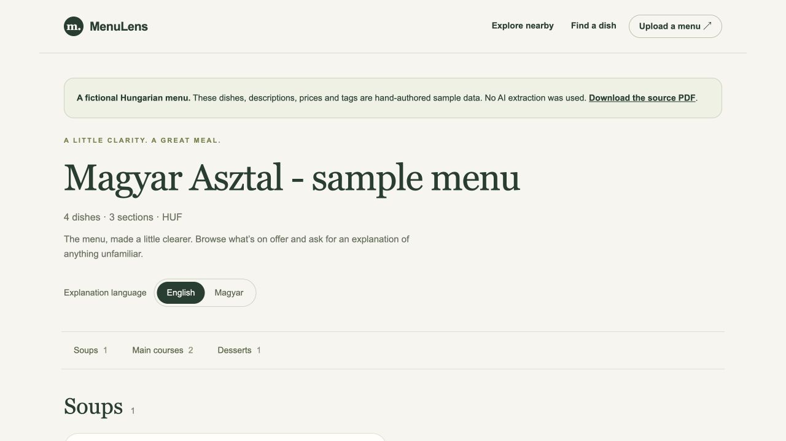
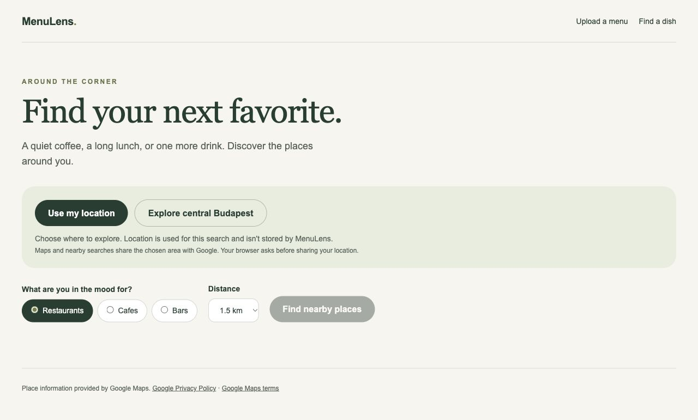
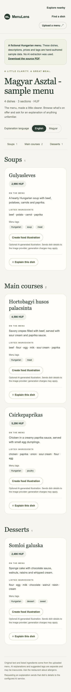

# MenuLens

**Understand the menu. Discover your next meal.**

MenuLens turns restaurant menus into readable dish cards. Upload a PDF or photo, explore unfamiliar dishes with AI explanations, search for what you feel like eating, and find nearby restaurants, cafes and bars.

Built with **Next.js, FastAPI and PostgreSQL**, with Docker for local setup.

## What can you try?

- Extract dishes, ingredients and prices from menus.
- Get short dish explanations in English or Hungarian.
- Search naturally, such as “chicken under 6000 HUF.”
- Generate representative food illustrations on demand.
- Explore nearby places on a map.

AI illustrations are labeled and are not restaurant photos. AI descriptions may be inaccurate; ask the restaurant about allergens.

## A look inside

### Read a menu



### Explore nearby



### On your phone



Screenshots show the fictional Hungarian demo and the discovery interface. Live maps and nearby results require Google keys.

## Run it locally

Install and start **Docker Desktop**. Clone this repository or download its ZIP, then open a terminal in the folder containing `docker-compose.yml`.

1. Copy `.env.example` to **`.env`** in that folder. Keep an existing `.env` if you already have one.
2. Start the app:

   ```sh
   docker compose up --build -d
   ```

3. Open **[localhost:3000](http://localhost:3000)**.

**No keys yet?** Open the [sample menu](http://localhost:3000/demo), or use **Choose filters** on the search page. Both work without API keys.

## Add your API keys

Edit the existing entries in your root **`.env`** file:

```dotenv
OPENAI_API_KEY=your_openai_key
MENU_AI_PROVIDER=openai
MENU_AI_MODEL=gpt-4.1-mini
IMAGE_PROVIDER=openai
IMAGE_MODEL=gpt-image-1-mini

MAPS_API_KEY=your_google_browser_key
PLACES_API_KEY=your_google_server_key
MAPS_MAP_ID=DEMO_MAP_ID
```

OpenAI powers menu understanding, explanations, natural-language search and images. Google needs **Maps JavaScript API** and **Places API (New)** enabled, with billing configured. Use a website-restricted browser key and a separate server key. API usage may incur charges.

Keep the other template settings. **Never commit `.env` or your actual keys.** After editing, apply the configuration with `docker compose up -d`.

## Take it for a spin

1. Open the demo and download its sample PDF.
2. [Upload](http://localhost:3000/upload) that PDF or your own menu, then start processing.
3. Open a dish and request an explanation or illustration.
4. [Search](http://localhost:3000/search) for “chicken under 6000 HUF.”
5. Visit [Explore](http://localhost:3000/explore), choose **Explore central Budapest**, and find nearby places.

To stop: `docker compose stop`. To resume: `docker compose start`. Your saved menus remain in Docker volumes; `docker compose down -v` deletes them.

## More information

[Setup & troubleshooting](docs/setup.md) · [API docs](http://localhost:8000/docs) · [Deployment & backups](docs/deployment.md) · [Tests & verification](docs/verification.md)

This is a local prototype without user accounts or public-deployment hardening. DeepSeek support is not implemented yet.
